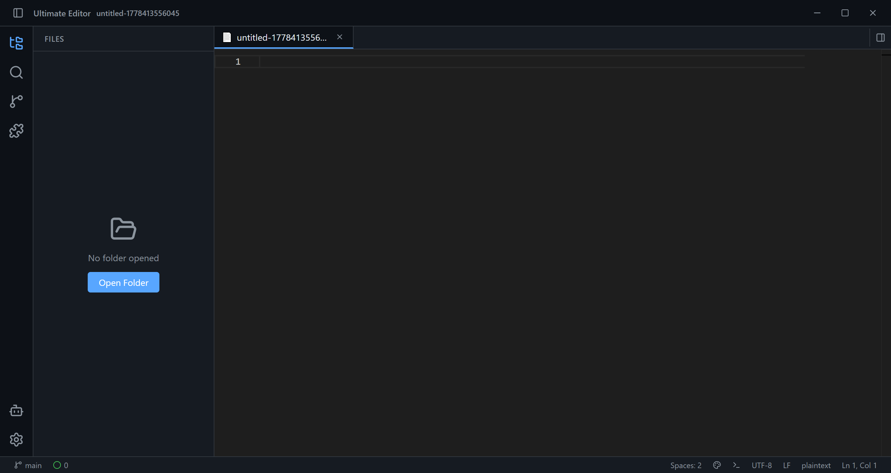
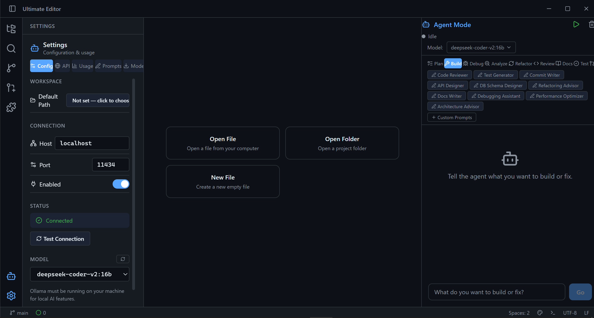
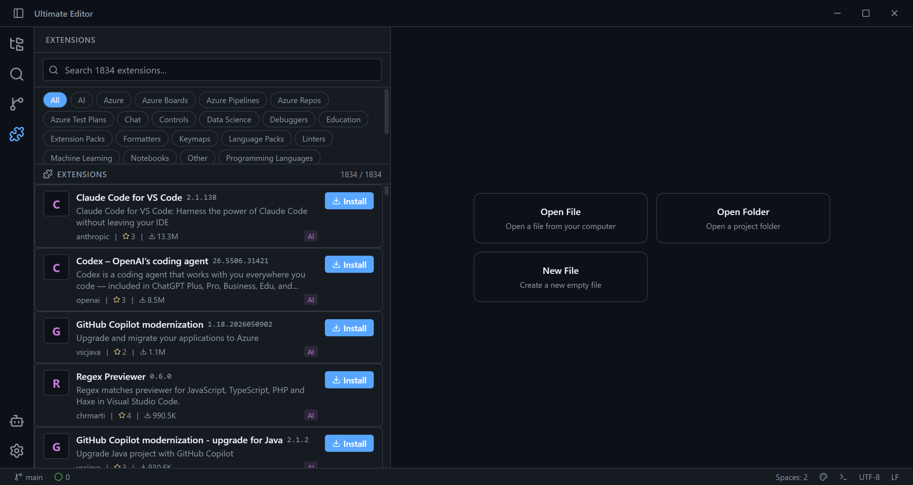
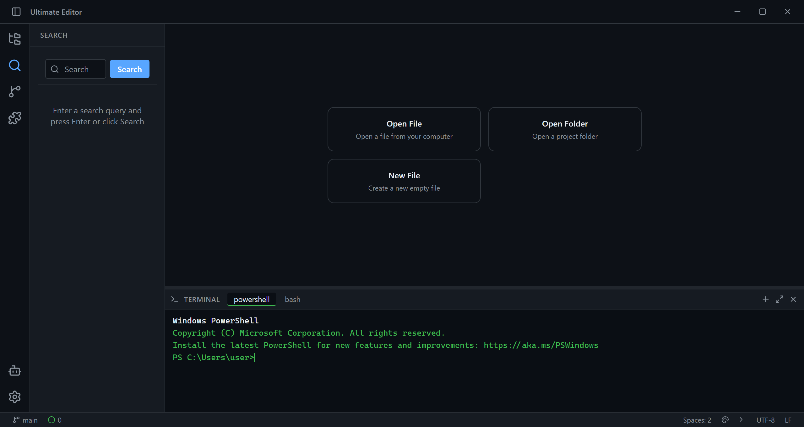
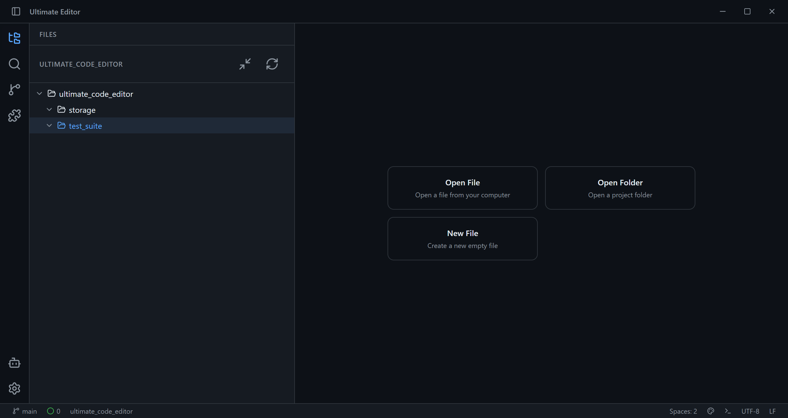
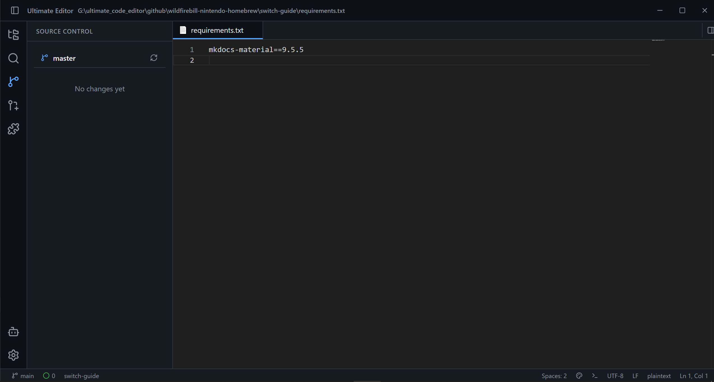
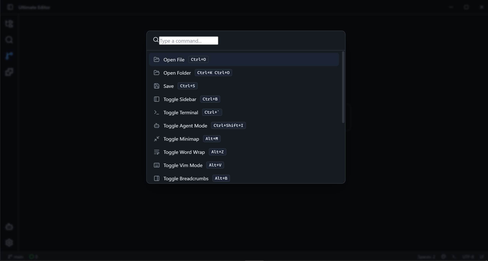
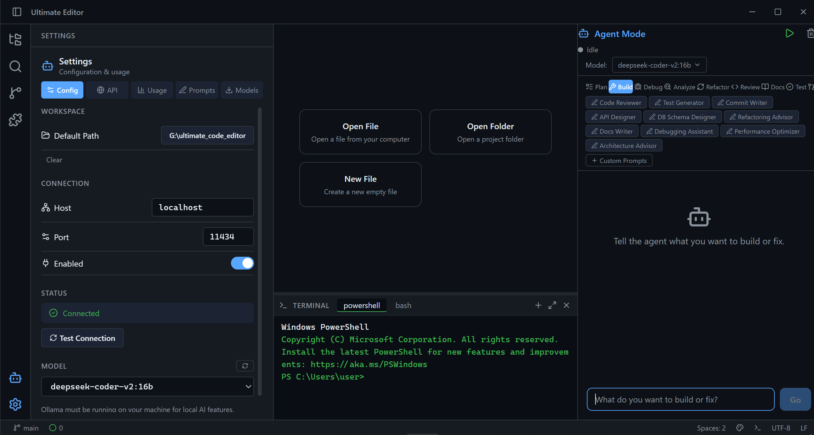
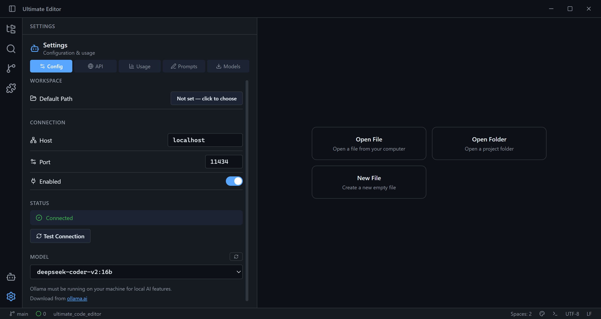
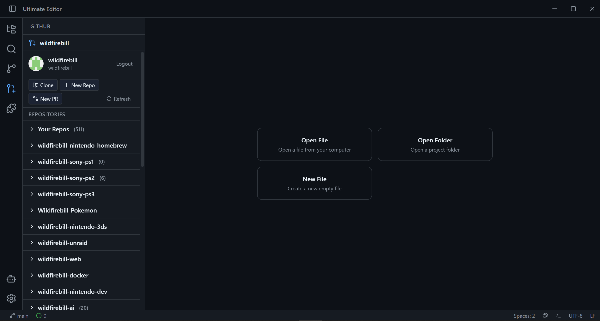

# Ultimate Editor

A production-ready Electron code editor combining the best features from
VS Code, Zed, Continue.dev, Tabby, Roo Code, Aider, and Void IDE.

## Features

- **Monaco Editor** — full VS Code editing experience with syntax
  highlighting for 100+ languages
- **AI Agent** — autonomous coding agent with multi-provider AI
  (OpenAI, Anthropic, Ollama, Groq, and 15+ more) that can chat,
  read/write files, run commands, and execute code
- **Extension Marketplace** — 1834 real VS Code extensions across
  27 official categories, with detail popups and install/uninstall
  buttons
- **Integrated Terminal** — full xterm.js terminal with PowerShell support
- **File Explorer** — tree-based file navigation with
  create/rename/delete context menu
- **Git Integration** — status, diff, staging, and commit workflow
- **GitHub Integration** — token-based auth, dashboard, repository browser with pagination, org accordion, direct clone to workspace, create repo, and create PR
- **Command Palette** — quick access to all editor actions
- **Split Layout** — resizable sidebar, editor, terminal, and agent panels
- **Cross-Platform** — Windows, macOS, and Linux builds via electron-builder

## Screenshots

| | |
|---|---|
|  |  |
|  |  |
|  |  |
|  |  |
|  |  |

## Tech Stack

- **Runtime:** Electron 42
- **UI:** React 19 + TypeScript 6
- **Editor:** Monaco Editor 0.55
- **Bundler:** Vite 8
- **State:** Zustand 5
- **Packaging:** electron-builder 26

## Getting Started

```bash
# Install dependencies
npm install

# Development
npm run dev

# Production build
npm run build

# Package for distribution
npm run dist:win    # Windows
npm run dist:mac    # macOS
npm run dist:linux  # Linux
```

## Project Structure

```
src/
  main/         Electron main process
  preload/      Context bridge (preload scripts)
  renderer/     React UI
    components/  UI components (Editor, Sidebar, Terminal, etc.)
    stores/      Zustand state management
    styles/      Global CSS
  shared/       Shared types
license/        MIT license + third-party notices
resources/      App icon and assets
scripts/        Extension data processing
```

## Security

- **GitHub Token** — stored in Electron's `userData` directory (`github-token.json`), isolated from the project directory. The token is only passed to the main process via IPC and never exposed to the renderer beyond session scoping.
- **Git Operations** — `git clone`, `git push`, and related commands are executed via `child_process.exec` in the main process. The clone URL and destination path are interpolated into shell commands. Repo names containing shell metacharacters could theoretically alter execution. All git operations run with user-level privileges.
- **CSP** — Content Security Policy restricts script sources to `'self'`, `'unsafe-inline'`, and `'unsafe-eval'` (required by Monaco Editor). External images are allowed only from `https://avatars.githubusercontent.com` for GitHub avatars.
- **IPC Surface** — All file system, git, and GitHub operations are mediated through explicit IPC handlers in the main process. The renderer has no direct access to Node.js APIs.

## License

MIT — see [LICENSE](./license/LICENSE). Third-party component licenses
are listed in [THIRD-PARTY-LICENSES.md](./license/THIRD-PARTY-LICENSES.md).
